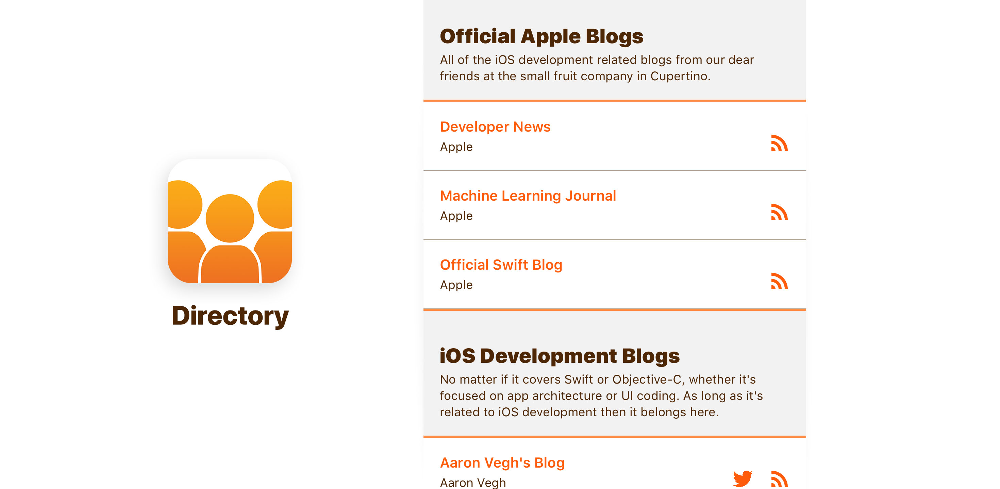

# Directory
An app for http://iosdevdirectory.com. The app simply presents `sites.json` from the source repo in a native app. 

# Why?

Im a native guy isn’t that reason enough? Ok maybe not. 

I rarely have free time to do something like this but when I do I tend to set myself a kinda Hackathon goal. This was the result. 

This was really just a few hours work, so I don't know if I'll ever get around to doing anything more on the app, but I thought it was worth sharing nonetheless.

> Note this app is not in any way affiliated or supported by iosdevdirectory.com or Dave Verwer who owns that site.

# Roadmap

I've created a few issues already, feel free to make other suggestions.
